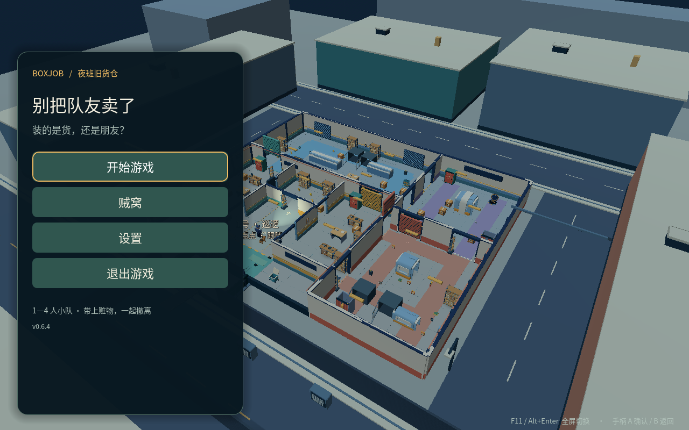

# 别把队友卖了 · BOXJOB

[进入官网介绍与下载](https://bojuejun.github.io/boxjob-downloads/)

暂定背景「城区封存前的最后一班」。进入即将封存的街区，搜寻目标、冒险搬运，在安保追逃中判断何时收手，带着收获主动撤离。先打磨一局好玩的搜撤，完整城市生活模拟不在本轮范围。

## 城市 0.7.4 · 独立单机预发布

- [Windows 城市试玩（53.2 MB）](https://github.com/BOJUEJUN/boxjob-downloads/releases/download/v0.7.4-city-playtest/BoxJob-City-074-Windows.zip)
- [Mac 城市试玩（75.8 MB）](https://github.com/BOJUEJUN/boxjob-downloads/releases/download/v0.7.4-city-playtest/BoxJob-City-074-Mac.zip)
- [版本说明与附件](https://github.com/BOJUEJUN/boxjob-downloads/releases/tag/v0.7.4-city-playtest)
- [SHA-256 校验值](https://github.com/BOJUEJUN/boxjob-downloads/releases/download/v0.7.4-city-playtest/SHA256SUMS.txt)

本版可体验单机搜撤、保安发现/追逐/跑脱后搜索返回/抓捕。核心街区保留固定布局，外围按种子持续生成与加载，并非每个房间完全随机。包含楼梯、地板、海岸护栏、临街边缘与远景显示修复。

加载偶有超过 200ms 的尖峰，外围美术仍需完善。玩家对战、城市人流、动态转运尚未接入城市版。

两平台 ZIP 完整性和 SHA-256 已核验。Mac 原包通过正常启动，实见角色选择与城市街景；源码场景完整图形搜撤与保安遭遇测试已通过，完整原包图形回合仍待验证。Windows 真机运行、安装和更新重启、实体手柄未测；无手机包。

城市版单独解压、单独启动，保留原正式版及存档，不通过原正式版自动更新。详见 [CITY-074.md](CITY-074.md)。

## 0.6.6 正式试玩 · 原有合作玩法

签名更新通道仍为 **0.6.6**，城市候选不会自动推送给旧正式版。

- [Windows 0.6.6](https://github.com/BOJUEJUN/boxjob-downloads/releases/download/v0.6.6/BoxJob-Windows-v0.6.6.zip)
- [Mac 0.6.6](https://github.com/BOJUEJUN/boxjob-downloads/releases/download/v0.6.6/BoxJob-Mac-v0.6.6.zip)
- [0.6.6 版本说明](https://github.com/BOJUEJUN/boxjob-downloads/releases/tag/v0.6.6)
- [0.6.6 校验值](https://github.com/BOJUEJUN/boxjob-downloads/releases/download/v0.6.6/SHA256SUMS.txt)

0.6.6 包含多种包装、整包撤离、改装与训练场、非致命推杆和敌方人机。支持 1–4 人同网组队，使用相同版本；语音默认关闭，主动开启后键盘 C / 手柄十字键上长按说话。高延迟下可能卡在装备同步；异地联机公共服务尚未配置。实体手柄、真实麦克风、Windows 真机安装及自动更新重启尚未验证。

## 安装说明

下载后完整解压到新文件夹，保留旧版，再打开游戏。城市版程序名为 BoxJob City 074。GitHub 自动提供的 **Source code** 压缩包是本下载网站归档，不是游戏。

Mac 城市包仅本地 ad-hoc 签名，未完成 Developer ID 签名与公证。遵循系统正常提示，遇到设备安全拦截请联系设备管理员。原正式版 0.5.0 起使用签名更新源；旧版 Windows 自动安装可能失败，可手动完整解压到独立文件夹。

[保留的旧版 0.6.4](https://github.com/BOJUEJUN/boxjob-downloads/releases/tag/v0.6.4) · [保留的旧版 0.6.3](https://github.com/BOJUEJUN/boxjob-downloads/releases/tag/v0.6.3) · [保留的旧版 0.6.2](https://github.com/BOJUEJUN/boxjob-downloads/releases/tag/v0.6.2) · [保留的旧版 0.6.1](https://github.com/BOJUEJUN/boxjob-downloads/releases/tag/v0.6.1) · [保留的旧版 0.6.0](https://github.com/BOJUEJUN/boxjob-downloads/releases/tag/v0.6.0) · [保留的旧版 0.5.0](https://github.com/BOJUEJUN/boxjob-downloads/releases/tag/v0.5.0) · [保留的旧版 0.4.0](https://github.com/BOJUEJUN/boxjob-downloads/releases/tag/v0.4.0)

本仓库只提供下载网站与发布附件，不包含游戏开发源码。素材许可见游戏包。

以下为 **0.6.4 旧版实际首页，非城市 0.7.4 画面**。

