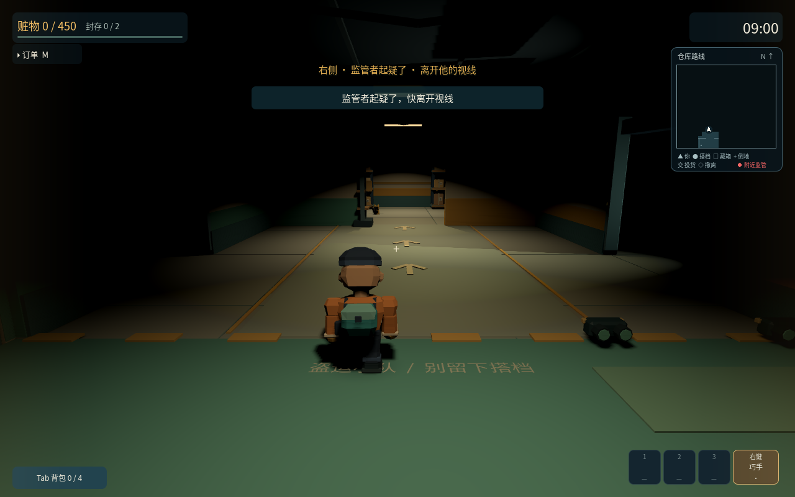

# 别把队友卖了 · BOXJOB

## [进入官网下载](https://bojuejun.github.io/boxjob-downloads/)

官方免费试玩下载 · **v0.6.3** · 无需登录

- [下载 Windows 版（54.3 MB）](https://github.com/BOJUEJUN/boxjob-downloads/releases/download/v0.6.3/BoxJob-Windows-v0.6.3.zip)
- [下载 Mac 版（75.9 MB）](https://github.com/BOJUEJUN/boxjob-downloads/releases/download/v0.6.3/BoxJob-Mac-v0.6.3.zip)
- [完整版本说明与附件](https://github.com/BOJUEJUN/boxjob-downloads/releases/tag/v0.6.3)
- [SHA256 校验值](https://github.com/BOJUEJUN/boxjob-downloads/releases/download/v0.6.3/SHA256SUMS.txt)
- [保留的旧版 0.6.2](https://github.com/BOJUEJUN/boxjob-downloads/releases/tag/v0.6.2)
- [保留的旧版 0.6.1](https://github.com/BOJUEJUN/boxjob-downloads/releases/tag/v0.6.1)
- [保留的旧版 0.6.0](https://github.com/BOJUEJUN/boxjob-downloads/releases/tag/v0.6.0)
- [保留的旧版 0.5.0](https://github.com/BOJUEJUN/boxjob-downloads/releases/tag/v0.5.0)
- [保留的旧版 0.4.0](https://github.com/BOJUEJUN/boxjob-downloads/releases/tag/v0.4.0)

下载后完整解压到新文件夹，保留旧版，再打开游戏。GitHub 自动提供的 **Source code** 压缩包不是游戏。

当前支持 1–4 人同网组队，使用相同版本。语音默认关闭，主动开启后键盘 C / 手柄十字键上长按说话、轻点标记。异地联机公共服务尚未配置。0.4.0 及更早版本升级需手动下载。0.5.0 起已接入 GitHub 签名更新源，下载会核对签名和哈希，网络失败保留旧版。Mac 未公证包会被系统阻止自动替换；旧版 Windows 自动安装可能失败，请完整解压新版到独立文件夹；已保留安装失败诊断与已下载文件夹入口。支持手柄按键与 R3 自由观察，已做模拟输入验证；Windows 真机自动安装、实体手柄和真实麦克风仍未实测。首次启用语音请遵循系统授权提示，本版无手机安装包。请遵循系统和设备管理员的正常提示。

本仓库只提供下载入口与发布附件，不包含游戏开发源码。使用说明与素材许可见游戏包。

v0.6.3：四人组队、按键语音、共享探索地图、黑暗开关灯与60秒夜视、11件趣味货物和清洁桶、按住 Alt / R3 自由观察。入仓才开始计时，精简菜单与 HUD，改善移动、拾取和关押视角。保安值班、敌队及完整押送救援尚未加入。

以下为 v0.6.3 游戏实机画面。

