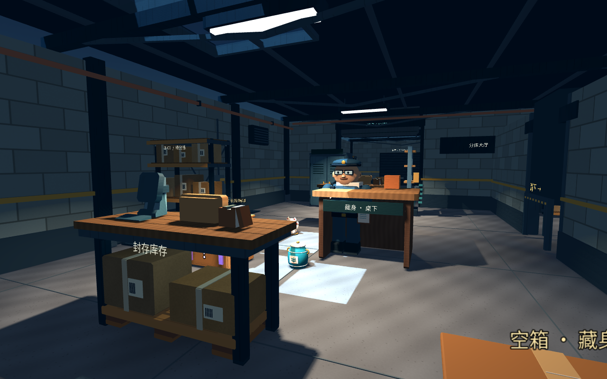

# 别把队友卖了 · BOXJOB

## [进入官网下载](https://bojuejun.github.io/boxjob-downloads/)

官方免费试玩下载 · **v0.6.1** · 无需登录

- [下载 Windows 版（53.2 MB）](https://github.com/BOJUEJUN/boxjob-downloads/releases/download/v0.6.1/BoxJob-Windows-v0.6.1.zip)
- [下载 Mac 版（74.8 MB）](https://github.com/BOJUEJUN/boxjob-downloads/releases/download/v0.6.1/BoxJob-Mac-v0.6.1.zip)
- [完整版本说明与附件](https://github.com/BOJUEJUN/boxjob-downloads/releases/tag/v0.6.1)
- [SHA256 校验值](https://github.com/BOJUEJUN/boxjob-downloads/releases/download/v0.6.1/SHA256SUMS.txt)
- [保留的旧版 0.6.0](https://github.com/BOJUEJUN/boxjob-downloads/releases/tag/v0.6.0)
- [保留的旧版 0.5.0](https://github.com/BOJUEJUN/boxjob-downloads/releases/tag/v0.5.0)
- [保留的旧版 0.4.0](https://github.com/BOJUEJUN/boxjob-downloads/releases/tag/v0.4.0)

下载后完整解压到新文件夹，保留旧版，再打开游戏。GitHub 自动提供的 **Source code** 压缩包不是游戏。

当前支持局域网双人试玩；异地联机公共服务尚未配置。0.4.0 及更早版本升级需手动下载。0.5.0 起已接入 GitHub 签名更新源，下载会核对签名和哈希，网络失败保留旧版。Mac 未公证包会被系统阻止自动替换；Windows 真机安装及实体手柄尚未实测。请遵循系统和设备管理员的正常提示。

本仓库只提供下载入口与发布附件，不包含游戏开发源码。使用说明与素材许可见游戏包。

v0.6.1：自动查找同网房间、三档难度、角色被动、可旋转选人预览。两位玩家请使用相同版本。

以下为保留的 v0.6.0 游戏实机画面。

